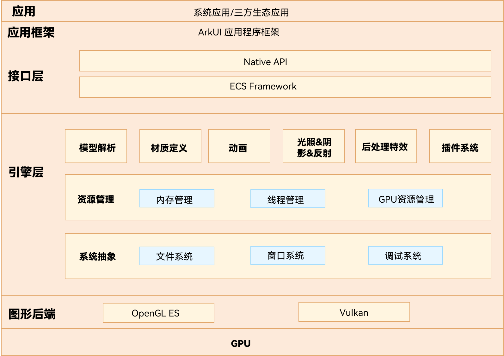

# AGP引擎

## 简介
AGP（Ark Graphics Platform）引擎是一款跨平台、高性能实时渲染的3D引擎，具有易用性、高画质、可扩展等特性。引擎使用先进的ECS（Entity-Component-System）架构设计，进行模块化封装（如材质定义、后处理特效等），为开发者提供了灵活易用的开发套件。AGP引擎支持Opengl ES/Vulkan后端，降低开发者对硬件资源依赖。

AGP引擎的主要结构如下图所示：



OpenHarmony 3D图形栈的分层说明如下：

• 接口层：提供图形的Native API能力以及ECS组件系统。

• 引擎层

| 模块                     | 能力描述                                                                                       |
|------------------------|--------------------------------------------------------------------------------------------|
| 模型解析         | 提供解析GLTF模型的能力。                                                                               |
| 材质定义            | 提供了PBR（基于物理的渲染）等材质的定义。                               |
| 动画           | 提供动画引擎的相关能力，如刚体、骨骼等。                            |
| 光照&阴影&反射 | 提供定向光、点光源、聚光源等光源；提供PCF（基于硬阴影的抗锯齿算法）等算法。      |
| 后处理特效 | 主要完成ToneMapping（色调映射）、Bloom（高亮溢出）、HDR（高动态范围成像）、FXAA（快速近似抗锯齿）、Blur（模糊）等后处理特效功能。      |
| 插件系统                | 提供了加载各种插件的能力，利用插件开发新功能。 |
| 资源管理                | 此模块提供了资源管理能力，主要包含内存管理、线程管理、GPU资源管理等。 |
| 系统抽象                | 主要包含了文件系统、窗口系统、调试系统等。 |

• 图形后端：支持OpenGL ES、Vulkan后端。

## 目录

```
foundation/graphic/graphic_3d/
├── 3d_widget_adapter                  # 适配ArkUI接口代码
├── lume                               # 引擎核心代码
│   ├── Lume_3D                        # ECS框架，3D模型解析，3D渲染基础能力
│   ├── LumeBase                       # 基础数据类型、数学库
│   ├── LumeEngine                     # 资源管理、线程管理、跨平台、插件系统
│   └── LumeRender                     # 引擎后端、渲染管线
│   └── LumeBinaryCompile              # 引擎shader（着色器）编译
```
## 编译构建
通过gn编译，在out目录下对应产品的文件夹中生成lib3dWidgetAdapter.z.so、libAGPDLL.z.so、libPluginAGP3D.z.so、libPluginAGPRender.z.so。
```
hb build graphic_3d
```
## 说明

### 使用说明
AGP引擎作为OpenHarmony的组件，提供系统的3D绘制能力，包含引擎的加载、自定义灯光、相机以及纹理等能力，供开发者自定义3D模型。
## 相关仓
- [**graphic_graphic_2d**](https://gitee.com/abbuu_openharmony/graphic_graphic_2d)
- [arkui_ace_engine](https://gitee.com/openharmony/arkui_ace_engine)
- [third_party_egl](https://gitee.com/openharmony/third_party_egl)
- [third_party_opengles](https://gitee.com/openharmony/third_party_opengles)
- [third_party_skia](https://gitee.com/openharmony/third_party_skia)